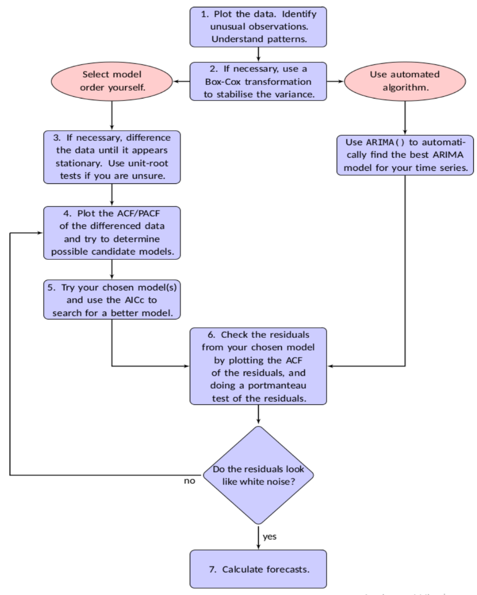

<h1>Time Series Forecasting Using ARIMA(AutoRegression Integrated MovingAverage)</h1>

Table of Contents

1.  Introduction to Time Series
    1.  Time Series
    2.  Time Series Components
        1.  Trend
        2.  Seasonality
        3.  Cyclicity
        4.  Seasonal v/s Cyclical
    3.  Stationary and Non- stationary Data
    4.  Differencing
2.  Time Series Techniques
    1.  Auto Regression
    2.  Moving Average
    3.  ARMA
    4.  Exponential Smoothing
    5.  ARIMA
3.  ARIMA (AutoRegression Integrated MovingAverage)
    1.  Autocorrelation
    2.  ACF
    3.  PACF
    4.  Seasonality
    5.  Model Selection and Parameters
    6.  White Noise and Residual Analysis
    7.  ADF (Augmented Dickey-Fuller) Test
    8.  Implementing ARIMA
    9.  Implementing SARIMAX
4.  Conclusion
5.  References
6.  Acknowledgements
7.  Appendices
    1.  ARIMA Forecast 1
    2.  ARIMA Forecast 2
```{=html}
<!-- -->
```
1.  Introduction to Time Series

A time series is a sequence of data points, measurements, or observations taken at successive points in time. Each data point is associated with a specific timestamp, allowing us to analyze changes and patterns that occur over time. Time series data often reveals temporal dependencies, where the value at one time point is influenced by previous values.

1.  Time Series analysis helps to identify and explain:

-   Any variation in data due to seasonality
-   Cyclic patterns that repeat
-   Trend in data
-   Growth rates in Trends

> Here is how a Time Series dataset looks like:
>
> We will be using this dataset and some other datasets also to forecast
> future demand/values using ARIMA.


1.  Time Series Components

> Time series can be decomposed into various components that help us
> understand its underlying structure:

1.  Trend:

> Persistent upward or downward pattern.
>
> The trend component represents the long-term movement or direction of
> the data. It showcases whether the data is generally increasing,
> decreasing, or staying relatively constant over time.
>
> In the time series plots below we can see two plots the google closing
> price plot is showing a uptrend and Egg price plot is showing a
> downtrend, marked with blue arrows
>
> {width="3.1273753280839895in"
> height="2.1916240157480313in"}{width="2.8115168416447944in"
> height="2.215379483814523in"}
>
> 1.2.2. Seasonality:
>
> It is repetitive and predictable pattern of data behavior in a time
> series around the trend line.
>
> Identification of seasonal effect provides better understanding of
> time series data.
>
> Elimination of seasonal effect from data is called De-Seasonalization
> or seasonal adjusting.
>
> In the beer production plot below, we can clearly see the seasonal
> patterns marked with double headed blue arrows.
>
> {width="3.5502734033245846in"
> height="2.5433552055993003in"}
>
> 1.2.3. Cyclicity:
>
> Cyclicity represents longer-term patterns that are not as regular as
> seasonality. These cycles might not have fixed periods but still
> influence the data over extended periods.
>
> {width="4.105515091863517in"
> height="2.1211122047244095in"}
>
> 1.2.4. Seasonal vs. Cyclical:
>
> Distinguishing between seasonality and cyclicity is essential.
>
> Both exhibit repeated patterns but, seasonality has fixed and
> consistent periods, while cyclicity is more flexible and might not
> follow a regular schedule.
>
> Seasonality shows regular pattern of up and down movement (usually
> within one year)
>
> Cyclicity shows repeating up and down movement (usually 2-10 years
> duration)

2.  Stationary and Non- stationary Data

> Stationarity is a crucial property in time series analysis, where
> statistical properties such as mean, variance, and autocorrelation
> remain constant over time.
>
> A stationary time series is one whose statistical properties do not
> depend on the time at which the series is observed.
>
> Thus, time series with trends, or with seasonality, are not stationary
> --- the trend and seasonality will affect the value of the time series
> at different times.
>
> But, a time series which looks like white noise series is stationary.
>
> We can see the stationary and non-stationary time series plots below.
> The first plot is non-stationary as it has both trend and seasonality,
> but the second plot is stationary.
>
> \*\*To perform forecasting using ARIMA we must make our data
> stationary\*\*

{width="3.239232283464567in"
height="2.2424912510936132in"}{width="3.2759306649168853in"
height="2.1632108486439194in"}

3.  Differencing

> In simple words, It is process of making non-stationary data into
> stationary data.
>
> Differencing involves computing the differences between consecutive
> observations to remove trends or seasonality that could be present in
> the data. This helps stabilize the mean and variance, making the data
> more amenable to modeling.
>
> **Lag:**
>
> Before delving deeper into differencing, let\'s first understand the
> concept of \"lag.\" A lag refers to the time interval between
> observations in a time series. When we say we\'re calculating the
> \"lag 1 difference,\" we\'re essentially looking at the difference
> between the current observation and the observation at the previous
> time point.
>
> **First-Order Difference (Lag 1 Difference)**: This involves
> subtracting each data point from its preceding data point (time t -
> time t-1). This can help remove linear trends and make the data
> stationary.
>
> First-Order Differencing: Y~t~' = Y~t~ -- Y~t-1~
>
> **Second-Order Difference (Lag 2 Difference)**: The second-order
> difference (Lag 2 Difference) involves subtracting the first-order
> differences.
>
> Second-Order Differencing: Y~t~'' = Y~t~' -- Y~t-1~'
>
> Y~t~'' = (Y~t~ -- Y~t-1~) -- (Y~t-1~ -- Y~t-2~)
>
> Y~t~'' = Y~t~ -- Y~t-1~ -- Y~t-1~ + Y~t-2~
>
> Finally, Y~t~'' = Y~t~ -- 2Y~t-1~ + Y~t-2~
>
> Similarly, we can find n^th^ order differencing.
>
> **Seasonal Difference**: Differencing can also be seasonal, where
> differences are calculated over the seasonal period (e.g., monthly
> differences for monthly data).
>
> A seasonal difference is the difference between an observation and the
> corresponding observation from last year.
>
> Seasonal Differencing: Y~t~' = Y~t~ -- Y~t-m~ where, m=number of
> seasons
>
> For example, for monthly data m = 12, for quarterly data m = 4
>
> \*\*If the data has both trend and seasonality then first take
> seasonal difference then do first difference\*\*
>
> Why Differencing?
>
> Differencing is essential because many time series models, like ARIMA,
> assume stationarity. By stabilizing the statistical properties of the
> data, these models become more accurate and reliable in capturing
> underlying patterns and making forecasts.
>
> In the following sections, we\'ll explore AutoRegressive Integrated
> Moving Average (ARIMA) models in detail, which incorporate
> differencing as a key component in their methodology.
>
> Differencing using pandas:
>
> In pandas we can simply perform differencing using shift() or diff().

df\[\'First_diff\'\] **=** df\[\'Demand\'\] **-**
df\[\'Demand\'\].shift(1)

df\[\'Second_diff\'\] **=** df\[\'First_diff\'\] **-**
df\[\'First_diff\'\].shift(1)

df\[\'Seasonal_diff\'\] **=** df\[\'Demand\'\] **-**
df\[\'Demand\'\].shift(12)

2.  Time Series Techniques

Time series techniques provide a systematic way to analyze and model
temporal data, capturing its inherent patterns and making accurate
forecasts. In this section, we\'ll explore several fundamental time
series techniques used in forecasting and analysis.

1.  Auto Regression

-   Auto Regression (AR) is a technique that models the relationship
    between a current observation and its past values, or lags. It
    assumes that the current value is a linear combination of its lagged
    values, with an added white noise term.

-   In simple words, Autoregression is regression of Y on itself
    observed at different time plots

-   AR models are denoted as AR(p), where \'p\' represents the number of
    lags used in the model.

> AR(1): Y~t~​ = c + ϕ~1~ ​Y~t−1~ ​+ ε~t~​
>
> Where, Y~t~​ ​ is the current value at time t.
>
> c is the intercept term.
>
> ϕ~1~ is the autoregressive coefficients for lag.
>
> Y~t−1~ is the lagged value.
>
> ε~t~​ represents the white noise error term at time t.
>
> AR(p): Y~t​~ = c + ϕ~1~​Y~t−1~​ + ϕ~2~​y~t−2~​ + ... + ϕ~p​~y~t−p~​ + ε~t~​
>
> Where: Y~t~ ​ is the current value at time t.
>
> c is the intercept term.
>
> ϕ1​, ϕ2​, ..., ϕp​ are the autoregressive coefficients for lags 1 to p.
>
> Y~t−1~​, Y~t−2~, ..., Y~t−p~​ are the lagged values.
>
> ε~t~​ represents the white noise error term at time t.
>
> AR(p) process models each future observations as a function of 'p'
> previous observations.
>
> Auto Regression vs. Linear Regression:
>
> Auto Regression (AR) and Linear Regression are both regression
> techniques, but they serve different purposes in different contexts.
> Let\'s explore the key differences between them using equations:
>
> Auto Regression (AR):
>
> The Auto Regression model represents the relationship between a
> variable and its own past values. It captures temporal dependencies by
> expressing the current value as a linear combination of its lagged
> values, plus a white noise term (error):
>
> AR(p): Y~t​~ = c + ϕ~1~​Y~t−1~​ + ϕ~2~​y~t−2~​ + ... + ϕ~p​~y~t−p~​ + ε~t~​
>
> Where: Y~t~ ​ is the current value at time t.
>
> c is the intercept term.
>
> ϕ1​, ϕ2​, ..., ϕp​ are the autoregressive coefficients for lags 1 to p.
>
> Y~t−1~​, Y~t−2~, ..., Y~t−p~​ are the lagged values.
>
> ε~t~​ represents the white noise error term at time t.
>
> Auto Regression captures temporal patterns and dependencies, making it
> suitable for time series data.
>
> Linear Regression:
>
> Linear Regression models the relationship between a dependent variable
> ( Y ) and one or more independent variables ( x~1~, x~2~, ... , x~n~
> ). It aims to find the best-fitting linear equation:
>
> Y = β ~0~ + β ~1~ x~1~ + β ~2~ x~2~ + ... + β ~n~ x~n~ + ε
>
> Where: Y is the dependent variable.
>
> β~0~, β ~1~, β~2~, ..., β~n~ are the regression coefficients.
>
> x~1~, x~2~, ..., x~n~ are the independent variables.
>
> ε represents the error term.
>
> Linear Regression focuses on predicting a continuous target variable
> based on features, without considering the temporal order of
> observations.

1.  Moving Average

-   Moving Average models focus on modeling the relationship between a
    current observation and its past white noise terms (random
    fluctuations). MA models don\'t consider past observations directly.

-   In simple words, A moving average is a time series model in which
    the value at time 't' is a linear function of past errors.

-   An MA(q) model includes \'q\' lagged white noise terms.

> MA(1): Y~t~​ = c + ε~t~ ​+ Θ~1~​ε~t−1~​ + Θ~2~​ε~t−2~​ + ... + Θ~q​~ε~t−q~​
>
> Where: Y~t~​ is the current value at time t.
>
> c is the intercept term.
>
> ε~t~ is the white noise error term at time t.
>
> Θ~1~ are the moving average coefficients for lags 1.
>
> ε~t−1~ are the lagged white noise terms.
>
> MA(q): Y~t~​ ​= c + ε~t~ ​+ Θ~1​~ε~t−1​~ + Θ~2~​ε~t−2~​ + ... + Θ~q~​ε~t−q~​
>
> Where: Y~t~ ​ is the current value at time t.
>
> c is the intercept term.
>
> ε~t​~ is the white noise error term at time t.
>
> Θ~1​~, Θ~2​~, ..., Θ~q~​ are the moving average coefficients for lags 1
> to q.
>
> ε~t−1~​, ε~t−2~ , ..., ε~t−q~​ are the lagged white noise terms.
>
> A Moving Average (MA) process models each future observation as a
> linear combination of \'q\' previous error terms, rather than past
> observations.

1.  ARMA

-   AutoRegressive Moving Average (ARMA) combines auto regression (AR)
    and moving average (MA) concepts to model time series data.

-   An ARMA(p, q) model includes both autoregressive and moving average
    terms.

> ARMA(p,q): Y~t​~ = c + ϕ~1~​Y~t−1~​ + ϕ~2~​y~t−2~​ + ... + ϕ~p​~y~t−p~​ +
> ε~t~ + Θ~1~ε~t−1~ + Θ~2~ε~t−2~ + ... + Θ~q~ε~t−q~
>
> Where: Y~t~ ​ is the current value at time t.
>
> c is the intercept term.
>
> ϕ1​, ϕ2​, ..., ϕp​ are the autoregressive coefficients for lags 1 to p.

Θ~1​~, Θ~2​~, ..., Θ~q~ are the moving average coefficients for lags 1 to
q.

> Y~t−1~​, Y~t−2~, ..., Y~t−p~​ are the lagged values.
>
> ε~t~​ represents the white noise error term at time t.
>
> An AutoRegressive Moving Average (ARMA) process models each future
> observation as a combination of \'p\' previous observations from the
> auto regressive component and \'q\' previous error terms from the
> moving average component.
>
> Finding orders (p,q) may not be easy. Generally Thump rules or other
> methods such as RMSE, MAPE, AIC, BIC are used.

1.  Exponential Smoothing

-   Exponential Smoothing models assign exponentially decreasing weights
    to past observations, emphasizing recent data more.

-   These models are suited for time series with trend and seasonality.

-   Different types of exponential smoothing models include Simple
    Exponential Smoothing (SES), Double Exponential Smoothing (Holt\'s
    method), and Triple Exponential Smoothing (Holt-Winters method).

> Simple Exponential Smoothing (SES): Y'~​t+1~​ = αY~t~ ​+ (1−α) Y​'~t~​
>
> Where: Y'~​t+1~​ is the forecasted value for the next time period.
>
> *α* is the smoothing parameter (0 \< *α* \< 1).
>
> Y~t~​ is the actual value at time *t*.
>
> Y'~t~​ is the forecasted value at time *t*.

1.  ARIMA

-   AutoRegressive Integrated Moving Average (ARIMA) is a versatile and
    widely used time series forecasting model that combines auto
    regression (AR), differencing (I), and moving average (MA)
    components.

-   ARIMA is particularly effective in capturing patterns, dependencies,
    and trends within time series data, making it a valuable tool for
    forecasting future values based on historical observations.

-   It has Three Components:

a.  AutoRegressive Component: Function of past values of the time series

b.  Integration: Differencing the time series to make it stationary

c.  MovingAverage Component: Function of past error values

> It is represented by the equation:
>
> Y t ​= c + ϕ1​Yt−1 ​+ ϕ2​Yt−2 ​ + ... + ϕp​yt−p ​+ θ1​εt−1 ​+ θ2​εt−2 ​+ ... +
> θq​εt−q ​+ εt​
>
> Where:
>
> Yt​ is the current value at time t.
>
> c is the intercept term.
>
> ϕ1​,ϕ2​,...,ϕp​ are the autoregressive coefficients for lags 1 to p.
>
> yt−1​,yt−2​,...,yt−p​ are the lagged values.
>
> θ1​,θ2​,...,θq​ are the moving average coefficients for lags 1 to q.
>
> εt−1​,εt−2​,...,εt−q​ are the lagged error terms.
>
> εt​ represents the white noise error term at time t.
>
> The differencing operation is applied d times to the time series data
> to achieve stationarity.
>
> Our main focus in this report will be on ARIMA(p,d,q) model.

3.  ARIMA (AutoRegression Integrated MovingAverage)

AutoRegressive Integrated Moving Average (ARIMA) models integrate auto
regression (AR), differencing (I), and moving average (MA) components to
model time series data. In this section, we explore the key components
and techniques involved in ARIMA modeling.

In this section we are going to define various terms involved in ARIMA
forecasting and perform the forecasting on demand-temperature dataset
simultaneously.

Let us first see a flowchart for general process of forecasting using
ARIMA model. We will follow steps shown in flowchart for forecasting:

{width="4.059524278215223in"
height="5.035239501312336in"}­­

1.  Autocorrelation

-   Autocorrelation measures the similarity between observations at
    different time points. It\'s essential for identifying patterns and
    dependencies within time series data.

-   In simple words, Autocorrelation is a correlation of a variable
    observed at two time points.

-   For example, if we find autocorrelation between Y~t~ and Y~t-1~ then
    it is called autocorrelation of lag 1. Similarly, autocorrelation
    between Y~t~ and Y~t-3~ is called autocorrelation of lag 3 and so
    on.

> Autocorrelation of lag k is represented by:
>
> {width="3.3956135170603674in"
> height="1.1490201224846894in"}
>
> Where: T is the total number of observations in the time series.
>
> y~t~ is the value of the time series at time t.

ȳ is the mean of the time series values.

> k is the lag for which autocorrelation is being calculated.
>
> This formula computes the correlation between the values at time t and
> the values at time t-k (the lagged values) for all applicable time
> points. It then normalizes the correlation by dividing it by the total
> variance of the time series.
>
> The AutoCorrelation Function (ACF) plot visually displays
> autocorrelation values at different lags.

1.  ACF

-   A k-period plot of autocorrelations is called Autocorrelation
    Function (ACF) or Correlogram.

-   The ACF plot shows the correlation between a variable and its lagged
    values.

-   Peaks and troughs in the ACF plot help determine potential values
    for the moving average (MA) order \'q\'.

> Let us see how we can plot ACF of our demand temperature dataset.
>
> {width="4.131247812773403in"
> height="1.3848545494313211in"}
>
> {width="4.35175634295713in"
> height="1.6007633420822398in"}

1.  PACF

-   Partial Autocorrelation of lag k is autocorrelation between y~t~ and
    y~t+k~ after the removal of linear dependence of y~t+1~ to y~t+k-1~.

-   The PACF plot reveals the direct relationship between a variable and
    its lagged values, excluding the influence of intermediate values.

-   It assists in identifying the order of the auto regressive (AR)
    component \'p\'.

> Let us see how we can plot ACF of our demand temperature dataset.
>
> {width="4.133413167104112in"
> height="1.068986220472441in"}
>
> {width="4.172560148731408in"
> height="1.599067147856518in"}

1.  Seasonality

-   Seasonality refers to repeating patterns in a time series at regular
    intervals

-   Identifying seasonality is crucial for capturing and modeling the
    periodic variations within the data

-   We can perform seasonal decomposition on our dataset to find
    possible seasonal patterns in our dataset

> Here is the code and output for seasonal decomposition of our demand
> temperature dataset.

{width="5.814880796150481in"
height="3.4802165354330707in"}

{width="6.374384295713035in"
height="3.2180555555555554in"}

The plot above shows our dataset contains seasonal pattern, but we need
a stationary time series to perform ARIMA forecasting. In this case we
must perform seasonal differencing to make our time series stationary,
which we have already discussed in section 1.4.

1.  Model Selection and Parameters

-   When working with ARIMA models, selecting the right values for the
    orders of auto regression (AR), differencing (I), and moving average
    (MA), denoted as (p, d, q), is crucial for building an accurate and
    effective model.

-   The process involves understanding the data\'s characteristics and
    using various tools to identify the optimal values for these
    parameters.

-   A lower AIC & BIC values indicates a better model fit. They
    penalizes models for being too complex.

-   Using ACF plots:

```{=html}
<!-- -->
```
-   If the ACF decreases gradually, it suggests an AR component may be
    needed.

-   If there\'s a sharp drop after lag \'k\', it indicates a potential
    AR order of \'k\'.

```{=html}
<!-- -->
```
-   Using PACF plots:

```{=html}
<!-- -->
```
-   If the PACF cuts off after lag \'k\', it suggests an MA component
    may be needed.

-   If there\'s a gradual decrease, it indicates a potential MA order of
    \'k\'.

> We can also use auto_arima() function to automatically find best fit
> ARIMA(p,d,q) parameters
>
> The **auto_arima** function in the **pmdarima** library (also known as
> Pyramid ARIMA) is designed to automatically select the best ARIMA
> model for a given time series data. It simplifies the process of model
> selection by searching through various combinations of parameters and
> identifying the one that provides the best fit to the data.
>
> Here\'s how the auto_arima function works:
>
> 1\. Data Input: The **auto_arima** function takes the time series data
> as input.
>
> 2\. Parameter Ranges: The function allows you to specify ranges for
> the maximum order of the auto regression (p), differencing (d), and
> moving average (q) components.
>
> 3\. Search Strategy: The **auto_arima** function performs an
> exhaustive search through the specified parameter ranges. It evaluates
> multiple candidate models with different combinations of (p, d, q)
> values to find the best-fitting model.
>
> 4\. Model Evaluation: For each candidate model, the function evaluates
> its fit to the data using criteria such as AIC, BIC, or other metrics.
> It compares these metrics to determine the quality of the model\'s
> fit.
>
> 5\. Best Model Selection: The function selects the model with the
> lowest AIC or BIC score as the best-fitting model. A lower score
> indicates a better trade-off between model complexity and fit to the
> data.
>
> 6\. Seasonal Component: The **auto_arima** function also considers the
> presence of seasonality in the data. If seasonality is detected, it
> automatically includes the seasonal ARIMA (SARIMA) component in the
> model. (we will discuss SARIMA and SARIMAX little later)
>
> 7\. Additional Parameters: You can also specify other parameters, such
> as whether to use stepwise search, whether to suppress warnings, and
> the frequency of the data (e.g., daily, monthly).
>
> 8\. Output: The function returns the best-fitting ARIMA model based on
> the specified criteria and parameter ranges. You can then use this
> model for forecasting and analysis.
>
> Let's use auto_arima on our dataset:
>
> {width="6.768055555555556in"
> height="3.972916666666667in"}
>
> After searching for best parameters it returns best fitted
> parameters(p,d,q). we can also print the summary of best fitted model
> using **best_model.summary().**
>
> For our dataset the best p,d,q are:
>
> {width="2.844698162729659in"
> height="0.44130030621172356in"}

1.  White Noise and Residual Analysis

    -   Residual analysis is a crucial step in assessing the validity of
        an ARIMA model.

    -   Residuals are the differences between the observed values and
        the values predicted by the model.

    -   A good ARIMA model should have residuals that resemble white
        noise, meaning they are random with no apparent pattern or
        correlation.

    -   The ACF of residuals should show no significant
        autocorrelations.

2.  ADF (Augmented Dickey-Fuller) Test

    -   The Augmented Dickey-Fuller (ADF) test is a statistical test
        used to determine the stationarity of a time series.

    -   Stationarity is a critical assumption for ARIMA models, as
        non-stationary data can lead to unreliable forecasts.

    -   The ADF test helps verify whether differencing is necessary to
        achieve stationarity.

    -   Here's the equation for ADF test:

> {width="4.5526312335958in"
> height="0.49826006124234473in"}
>
> Let's see how we do ADF test for our dataset and accept or reject null
> hypothesis.
>
> Null hypothesis: H~o~ = Dataset is non-Stationary
>
> ADF test will return p-value. If p-value is \< 0.05 then we will
> reject null hypothesis.
>
> ADF test for un-differenced series
>
> {width="2.8817279090113734in"
> height="0.5534000437445319in"}
>
> {width="3.0284383202099736in"
> height="0.5721237970253719in"}
>
> ADF test for seasonally and first differenced Series
>
> {width="3.4045439632545933in"
> height="0.8574529746281715in"}{width="3.3100492125984253in"
> height="0.5961220472440945in"}
>
> As p-value is \<\<0.05 we will reject null hypothesis and assume the
> time series is stationary.

3.  Implementing ARIMA

    -   Implementing ARIMA model Includes Training, Evaluating and
        Forecasting future values.

    -   It is already discussed that Evaluating process includes
        Residual analysis in section 3.6

    -   Implementing ARIMA model can be an Iterative process as we have
        to train model using various p,d,q values to get the best model
        and accurate forecast

    -   One more important thing to consider is 'Model Selection'. We
        must select between ARIMA, SARIMA and SARIMAX. They are just
        extensions of ARIMA model.

> Model Selection (ARIMA/SARIMA/SARIMAX):
>
> Selecting the appropriate ARIMA model, whether it\'s the basic ARIMA,
> Seasonal ARIMA (SARIMA), or Seasonal ARIMA with Exogenous Variables
> (SARIMAX), requires careful consideration of the data\'s
> characteristics and the specific forecasting requirements. Each model
> type has its strengths and considerations.
>
> ARIMA:

-   AutoRegressive Integrated Moving Average (ARIMA) models are suitable
    for time series data that exhibit trends and dependencies.

-   The basic ARIMA model includes auto regressive (AR) and moving
    average (MA) components and is represented by: ARIMA(p,d,q).

-   It\'s effective for capturing patterns that evolve over time, but it
    may not handle seasonal variations well.

> SARIMA (Seasonal ARIMA):

-   Seasonal ARIMA (SARIMA) extends the basic ARIMA model to accommodate
    time series data with seasonal patterns.

-   It introduces additional seasonal auto regressive (SAR) and seasonal
    moving average (SMA) components and is represented by
    ARIMA(p,d,q)(P,D,Q)S , with p = non-seasonal AR order, d =
    non-seasonal differencing, q = non-seasonal MA order, P = seasonal
    AR order, D = seasonal differencing, Q = seasonal MA order, and S =
    time span of repeating seasonal pattern

-   SARIMA models are especially useful when dealing with data that
    exhibit recurring patterns at fixed intervals, such as monthly or
    yearly cycles.

> SARIMAX (Seasonal ARIMA with Exogenous Variables):

-   SARIMAX further expands the capabilities of SARIMA by incorporating
    exogenous variables that can influence the time series.

-   Exogenous variables are external factors that might impact the time
    series but are not part of the inherent pattern.

-   Incorporating these variables into the model can enhance forecasting
    accuracy by capturing external influences.

> Remember in section 3.4 when we did seasonal decomposition, we found
> that our data is seasonal. It means we should use SARIMA model. Also,
> in section 1.1 when we plotted our dataset i.e., demand temperature
> dataset, it contains two variables Temperature and Demand. Our focus
> is on forecasting demand, but it is dependent on Temperature also, so
> we will consider temperature as exogenous variable and use SARIMAX to
> train model in next section.

4.  Implementing SARIMAX

> In this section, we\'ll walk through the steps to implement Seasonal
> AutoRegressive Integrated Moving Average with Exogenous Variables
> (SARIMAX) for forecasting demand while considering temperature as an
> exogenous variable. The inclusion of temperature as an exogenous
> variable allows the model to account for the external influence of
> temperature on demand.
>
> Model Fitting:

-   Importing Libraries:

> We will be using Python\'s statsmodels library to import the SARIMAX
> class.
>
> {width="5.18034886264217in"
> height="0.28741141732283465in"}

-   Model Training:

> First dividing dataset into training and testing dataset
>
> {width="3.764341644794401in"
> height="0.5274868766404199in"}
>
> As the length of our dataset was 1360, we are using 1300 datapoints as
> training dataset and remaining for testing and forecasting.
>
> Training:
>
> {width="6.18371719160105in"
> height="0.6852471566054243in"}
>
> In this code:

-   train\[\"dem\"\] represents the endogenous variable (demand) from
    the training set.

-   train\[\"temp\"\] serves as the exogenous variable (temperature)
    from the training set.

-   order=(1, 1, 3) specifies the non-seasonal ARIMA order.

-   seasonal_order=(1, 1, 3, 24) indicates the seasonal ARIMA order,
    with a seasonal period of 24 hours (daily data)

-   After fitting the model, we can print a summary of the model\'s
    characteristics using the results.summary() function.

> Summary of Model's characteristics.
>
> {width="4.545185914260718in"
> height="2.8270308398950132in"}

-   Forecasting:

    -   Now, our model is trained.

    -   We can use get_forecast() function to forecast future values as
        shown below.

    -   Also, we can extract confidence intervals for the predictions to
        assess the uncertainty of the forecasts.

{width="6.768055555555556in"
height="1.1875in"}

-   Plotting Forecast:

> Now we can visualize the actual demand, predicted demand, and
> temperature over the testing period. Plotting the data helps assess
> how well the model captures the patterns and fluctuations.

{width="7.236069553805774in"
height="1.7701465441819773in"}

Output:

{width="6.768055555555556in"
height="2.073611111111111in"}

Conclusion:

\"In this section, we applied the Seasonal AutoRegressive Integrated
Moving Average with Exogenous Variables (SARIMAX) model to forecast
demand while considering temperature as an exogenous variable. The
forecast looks quite accurate. Further model training and evaluation can
be carried out by choosing different p, d, q, P, D, Q, S parameters in
hope of finding a more accurate model.

Complete implementation code can be found on GitHub repository:
<https://github.com/Mukul-kYadav/ARIMA/blob/main/demand_temperature.ipynb>

4.  Conclusion:

Throughout this project, we embarked on a comprehensive journey into
time series analysis and forecasting, leveraging the power of the
AutoRegressive Integrated Moving Average (ARIMA) model and its extended
variants. Our primary objective was to forecast demand based on
historical data, with a focus on capturing the influence of external
factors, such as temperature.

Key Insights and Achievements:

-   Time Series Understanding: We began by establishing a strong
    foundation in time series concepts, differentiating them from
    conventional datasets. We explored the components of time series
    data, including trend, seasonality, and cyclicity, which enabled us
    to better comprehend the complexities inherent in our dataset.

-   Model Selection and Parameter Tuning: In the quest for accurate
    forecasting, we delved into various time series techniques,
    culminating in the selection of the ARIMA model. We intricately
    examined the AutoRegressive (AR) and Moving Average (MA) components,
    emphasizing the significance of differencing for achieving
    stationarity. The iterative process of selecting optimal model
    orders (p, d, q) based on AutoCorrelation Function (ACF) and Partial
    AutoCorrelation Function (PACF) plots, as well as the employment of
    the Akaike Information Criterion (AIC) and Bayesian Information
    Criterion (BIC), fortified our model\'s precision.

-   Temperature-Driven Demand Forecasting: Recognizing the impact of
    temperature on demand, we extended our forecasting prowess by
    integrating Seasonal AutoRegressive Integrated Moving Average with
    Exogenous Variables (SARIMAX). By treating temperature as an
    exogenous variable, we harnessed the ability to capture external
    influences and exploit their predictive potential. The results
    underscored the value of incorporating temperature in demand
    forecasting, enhancing our model\'s accuracy and granularity.

Implications and Applications:

-   Operational Efficiency: Our forecasts have tangible implications for
    operational efficiency across various industries. Businesses can
    make informed decisions regarding inventory management, supply chain
    planning, and resource allocation, leading to optimized resource
    utilization and cost savings.

-   Strategic Decision-Making: Accurate demand forecasting serves as a
    strategic asset for decision-makers. It equips them with foresight
    to adjust marketing strategies, allocate resources effectively, and
    make informed investments based on projected demand trends.

Access to Complete Codebase:

For those seeking an in-depth understanding of ARIMA implementation, the
complete code for demand-temperature forecasting ( and other datasets
also) using ARIMA and SARIMAX can be accessed on our GitHub repository:
<https://github.com/Mukul-kYadav/ARIMA>

5.  References

```{=html}
<!-- -->
```
1.  Forecasting: Principles and Practice
    <https://otexts.com/fpp3/arima.html>

2.  <https://online.stat.psu.edu/stat510/lesson/4/4.1>

3.  Time Series Analysis Handbook:
    <https://phdinds-aim.github.io/time_series_handbook/Preface/Preface.html>

4.  ARIMA Model -- Complete Guide to Time Series Forecasting in Python

> <https://www.machinelearningplus.com/time-series/arima-model-time-series-forecasting-python/>

5.  Time Series Forecasting with ARIMA, SARIMA and SARIMAX

> <https://towardsdatascience.com/time-series-forecasting-with-arima-sarima-and-sarimax-ee61099e78f6>

6.  How to Create an ARIMA Model for Time Series Forecasting in Python

> <https://machinelearningmastery.com/arima-for-time-series-forecasting-with-python/>

7.  Appendices

Along with the demand temperature dataset I also forecasted some other
time series also.

The forecasted output and GitHub repository link for complete code is
given below.

1.  ARIMA Sales Forecast:

    -   Dataset

> {width="1.5116776027996501in"
> height="1.4374015748031497in"}

-   Time Series Plot

{width="6.583728127734033in"
height="1.374484908136483in"}

-   Actual v/s Forecast Plot

{width="6.768055555555556in"
height="2.7625in"}

-   GitHub repository link for complete code

> <https://github.com/Mukul-kYadav/ARIMA/blob/main/sales.ipynb>

2.  ARIMA electricity Forecast:

    -   Dataset

> {width="1.5518449256342957in"
> height="1.9363112423447069in"}

-   Time Series Plot

{width="6.768055555555556in"
height="1.85625in"}

-   Actual v/s Forecast Plot

{width="6.768055555555556in"
height="2.0208333333333335in"}

-   GitHub repository link for complete code

> <https://github.com/Mukul-kYadav/ARIMA/blob/main/electricity.ipynb>
